# AI Class Notes Assistant

A lightweight, production-ready AI assistant for managing and chatting with your class notes and documents. Built with FastAPI, OpenAI, and local storage for easy deployment.

## 🎯 Overview

```mermaid
graph TD
    A[📁 Upload Documents] --> B[🤖 AI Processing]
    B --> C[💾 Local JSON Storage]
    C --> D[🔍 Vector Search]
    D --> E[💬 AI Chat & Agents]
    E --> F[📊 Generated Content]
    
    G[🌐 Web Interface] --> A
    H[🔧 REST API] --> A
    
    I[🐳 Docker Deploy] --> J[🚀 Production Ready]
    K[⚡ Quick Start] --> J
```



**Simple 3-Step Process:**

1. **Start**: `./quick_start.sh your_openai_key`
2. **Open**: `http://localhost:8000`  
3. **Use**: Upload docs → Chat → Get AI insights

## ✨ Features

### 📁 Document Management
- **File Upload**: PDF, TXT, DOCX support (up to 10MB)
- **Smart Processing**: Automatic text extraction and chunking
- **Vector Storage**: Efficient similarity search with sentence-transformers
- **Local Storage**: No external databases required

### 🤖 AI Agents
- **💬 Chat Assistant**: Context-aware conversations with your documents
- **📚 Study Planner**: Generate personalized study plans
- **📝 Assignment Helper**: Get structured assignment guidance
- **🧠 Concept Explainer**: Detailed explanations with document context
- **📄 Text Summarizer**: Smart text summarization

### 🌐 Web Interface
- **Responsive Design**: Works on desktop and mobile
- **Real-time Chat**: Instant AI responses
- **File Management**: Easy upload and document viewing
- **Agent Tools**: Integrated AI agent functions

### 🔧 Technical Features
- **FastAPI Backend**: High-performance async API
- **OpenAI Integration**: GPT-3.5/4 powered responses
- **Local Vector Store**: No external vector database needed
- **Docker Support**: Container-ready deployment
- **CORS Enabled**: Frontend flexibility

## 🚀 Quick Start

### Prerequisites

- Python 3.8+
- OpenAI API key ([Get one here](https://platform.openai.com/api-keys))

### Option 1: Quick Start Script (Recommended)

```bash
# Clone repository
git clone https://github.com/Laksh-Mendpara/RAG-MCP-Study.git
cd RAG-MCP-Study

# One-command setup and start
./quick_start.sh your_openai_api_key_here
```

### Option 2: Manual Setup

```bash
# 1. Install dependencies
cd backend
pip install -r requirements.txt

# 2. Set up environment
echo "OPENAI_API_KEY=your_api_key_here" > .env

# 3. Start the server
python main.py
```

### Option 3: Docker Deployment

```bash
# Build and run with Docker Compose
echo "OPENAI_API_KEY=your_api_key_here" > .env
docker-compose up --build

# Or build manually
docker build -t ai-notes-assistant .
docker run -p 8000:8000 -e OPENAI_API_KEY=your_key_here ai-notes-assistant
```

## 🌐 Access the Application

Once started, access the application at:
- **Web Interface**: `http://localhost:8000`
- **API Documentation**: `http://localhost:8000/docs` (Swagger UI)
- **Alternative API Docs**: `http://localhost:8000/redoc`

## 🤖 AI Agent Usage

### 📚 Study Planner
1. Enter subject, topics, and deadline
2. Click "Generate Study Plan"
3. Get a personalized weekly study schedule

### 📝 Assignment Helper
1. Describe your assignment and requirements
2. Click "Get Assignment Help"
3. Receive structured guidance and approach

### 🧠 Concept Explainer
1. Enter any concept you want explained
2. The system uses your uploaded documents for context
3. Get detailed explanations with relevant examples

### 📄 Text Summarizer
1. Paste text you want summarized
2. Get concise summaries with length metrics
3. Perfect for long articles or research papers

## 📁 Project Structure

```
RAG-MCP-Study/
├── backend/
│   ├── main.py              # FastAPI application
│   ├── config.py            # Configuration settings
│   ├── storage.py           # JSON-based storage
│   ├── vector_store.py      # Vector similarity search
│   ├── llm.py               # OpenAI interface
│   ├── document_processor.py # Document processing
│   ├── requirements.txt     # Python dependencies
│   ├── static/              # Web frontend
│   └── data/                # Storage directory
├── Dockerfile              # Container configuration
├── docker-compose.yml      # Docker Compose setup
├── quick_start.sh          # Quick setup script
└── README.md              # This file
```

## 🔧 API Endpoints

The application provides a comprehensive REST API:

### Core Endpoints
- `GET /` - Web interface
- `GET /health` - Health check
- `GET /stats` - System statistics

### Document Management
- `POST /upload` - Upload documents (PDF, TXT, DOCX)
- `GET /documents` - List uploaded documents
- `POST /search` - Search through documents

### AI Chat & Context
- `POST /chat` - Chat with AI assistant
  ```json
  {"message": "your question", "use_context": true}
  ```

### AI Agents
- `POST /study-plan` - Generate study plans
- `POST /assignment-help` - Get assignment guidance
- `POST /explain-concept` - Explain concepts with context
- `POST /summarize` - Summarize text content
- `GET /generated-content` - View all generated content

## 💾 Data Storage

All data is stored locally in the `backend/data/` directory:
- `documents.json` - Document metadata
- `chunks.json` - Text chunks for vector search
- `chat_history.json` - Chat conversations
- `generated_content.json` - AI-generated content
- `vectors/` - Vector embeddings for similarity search

## 🛠️ Configuration

Key settings in `backend/config.py`:
- `OPENAI_API_KEY` - Your OpenAI API key
- `OPENAI_MODEL` - Model to use (default: gpt-3.5-turbo)
- `MAX_FILE_SIZE` - Maximum upload size (10MB)
- `CHUNK_SIZE` - Text chunk size for processing (500)
- `EMBEDDING_MODEL` - Sentence transformer model

## 📊 Dependencies

Minimal, production-ready dependencies:
- **FastAPI** - Modern web framework
- **OpenAI** - GPT model integration
- **sentence-transformers** - Text embeddings
- **pdfplumber** - PDF text extraction
- **python-docx** - Word document processing
- **numpy** - Vector operations

## 🔧 Troubleshooting

### Common Issues

**Chat not working?**
- Check if OpenAI API key is set correctly
- Verify you have credits in your OpenAI account
- Look at backend logs for specific errors

**Upload failing?**
- Ensure file is under 10MB
- Check file format (PDF, TXT, DOCX only)
- Verify backend is running and accessible

**Docker issues?**
- Make sure ports 8000 is available
- Check if Docker daemon is running
- Verify environment variables are set

### Logs and Debugging
- Backend logs appear in the terminal
- Check `backend/data/logs/app.log` for detailed logs
- Use browser dev tools to inspect frontend errors

## 🚀 Production Deployment

### Environment Variables
```bash
# Required
OPENAI_API_KEY=your_api_key_here

# Optional
DEBUG=False
LOG_LEVEL=INFO
HOST=0.0.0.0
PORT=8000
```

### Docker Production
```bash
# Build production image
docker build -t ai-notes-assistant .

# Run with production settings
docker run -d \
  -p 8000:8000 \
  -e OPENAI_API_KEY=your_key \
  -e DEBUG=False \
  -v /path/to/data:/app/backend/data \
  ai-notes-assistant
```

## 📄 License

This project is licensed under the MIT License - see the [LICENSE](LICENSE) file for details.

## 🤝 Contributing

1. Fork the repository
2. Create a feature branch (`git checkout -b feature/amazing-feature`)
3. Commit your changes (`git commit -m 'Add amazing feature'`)
4. Push to the branch (`git push origin feature/amazing-feature`)
5. Open a Pull Request

## ⭐ Support

If you find this project helpful, please give it a star on GitHub!


## 📑 Project Report

- [Project Demo Video (Google Drive)](https://drive.google.com/file/d/1s-uy6phj2ApJ2fLJf-OY3SHTP8AHnUzc/view?usp=sharing)
- [project.pdf (local, in assets folder)](https://github.com/yuvrajk110905/RAG-MCP-Study2/blob/main/assests/project.pdf)

For issues and questions, please open an issue in the GitHub repository.
